# Stryke X — Institutional Quant Research & Backtesting Platform

## Technical Architecture & Research Report

| Field | Value |
|-------|-------|
| **Document ID** | STRYKE-X-ARCH-2026-001 |
| **Version** | 1.2 |
| **Revision Date** | June 2026 |
| **Codebase Baseline** | `ce4d02af` |
| **Classification** | Internal — Quantitative Research |
| **Market Scope** | NSE / BSE — Indian Equities & Index Derivatives |
| **Status** | Active / Production-Ready (Research Environment) |

---

## Table of Contents

1. [Executive Summary](#1-executive-summary)
2. [Research Objectives & Design Philosophy](#2-research-objectives--design-philosophy)
3. [System Architecture](#3-system-architecture)
4. [Technology Stack](#4-technology-stack)
5. [Data Infrastructure & Ingestion Pipeline](#5-data-infrastructure--ingestion-pipeline)
6. [Database Architecture](#6-database-architecture)
7. [Backtesting Engine](#7-backtesting-engine)
8. [Options Analytics Engine](#8-options-analytics-engine)
9. [Cognitive Layer — LLM, Agent, RAG & MCP](#9-cognitive-layer--llm-agent-rag--mcp)
10. [Quant Pipeline API](#10-quant-pipeline-api)
11. [Execution & Deployment Subsystem](#11-execution--deployment-subsystem)
12. [Model Training & RL Pipeline](#12-model-training--rl-pipeline)
13. [Presentation Layer](#13-presentation-layer)
14. [API Reference Summary](#14-api-reference-summary)
15. [Quantitative Research Methodology](#15-quantitative-research-methodology)
16. [Performance Benchmarks](#16-performance-benchmarks)
17. [Operational Deployment](#17-operational-deployment)
18. [Capability Matrix & Research Roadmap](#18-capability-matrix--research-roadmap)
19. [Known Limitations & Risk Disclosure](#19-known-limitations--risk-disclosure)
20. [Appendix](#20-appendix)

---

## 1. Executive Summary

**Stryke X** is an institutional-grade quantitative research operating system purpose-built for **Indian capital markets** — Nifty 50, Bank Nifty, FinNifty, MidcapNifty, and 1,800+ NSE-listed equities. The platform unifies five horizontally decoupled subsystems into a single reproducible research workflow:

| Subsystem | Function |
|-----------|----------|
| **Cognitive Reasoning Layer** | Local LLM (DeepSeek-R1 via Ollama) + RAG (Qdrant) for strategy hypothesis synthesis |
| **Compilation Engine** | Natural-language / Pine Script → structured `strategy_spec` JSON |
| **Backtesting Engine** | VectorBT vectorized simulation with institutional-grade metrics |
| **Data Infrastructure** | TimescaleDB hypertables, Redis cache, Parquet local store |
| **Presentation Layer** | Vanilla JS research UI + React 19 component library |

Unlike retail strategy builders, Stryke X prioritises **statistical integrity**, **computational efficiency**, and **deterministic replay** over feature breadth. Every backtest is subject to explicit bias-prevention constraints, configurable transaction costs, and optional out-of-sample validation via the pipeline optimizer.

The platform supports the full research lifecycle:

```
Hypothesis → Strategy Spec → Backtest → Validation → Optimization → Paper Execution → (Live Deployment)
```

All inference, embedding, and backtesting workloads run **locally** — no paid cloud LLM APIs, no external data vendor lock-in for historical OHLCV.

---

## 2. Research Objectives & Design Philosophy

### 2.1 Primary Research Objectives

1. **Reproducibility** — Identical `strategy_spec` + symbol + period must yield identical results (modulo cache TTL).
2. **Low Latency Iteration** — Sub-100 ms backtests on cache miss; sub-millisecond on Redis hit.
3. **Domain Grounding** — LLM outputs constrained to compiler-accepted indicator vocabulary and NSE symbol conventions.
4. **Auditability** — Every backtest run persistable to Postgres with full trade log, equity curve, and strategy spec snapshot.

### 2.2 Design Principles

| Principle | Implementation |
|-----------|----------------|
| DB-first data reads | Postgres `ohlcv` hypertable before yfinance fallback |
| Regex-before-LLM | `nl_parser.py` fast path for RSI, SMA crossover, options patterns |
| Vectorized simulation | VectorBT `Portfolio.from_signals()` — no Python loops on time series |
| Fail-soft caching | Redis primary; in-memory dict fallback if Redis unavailable |
| Separation of concerns | MCP tools decouple LLM from engine; pipeline routes decouple UI from orchestration |

### 2.3 Target User Personas

- **Quantitative researcher** — multi-condition rule design, parameter sweeps, walk-forward analysis
- **Systematic options trader** — CE/PE/Straddle backtests on index underlyings
- **ML engineer** — QLoRA fine-tuning on strategy QA pairs; PPO parameter optimization via RL env

---

## 3. System Architecture

### 3.1 Layer Decomposition

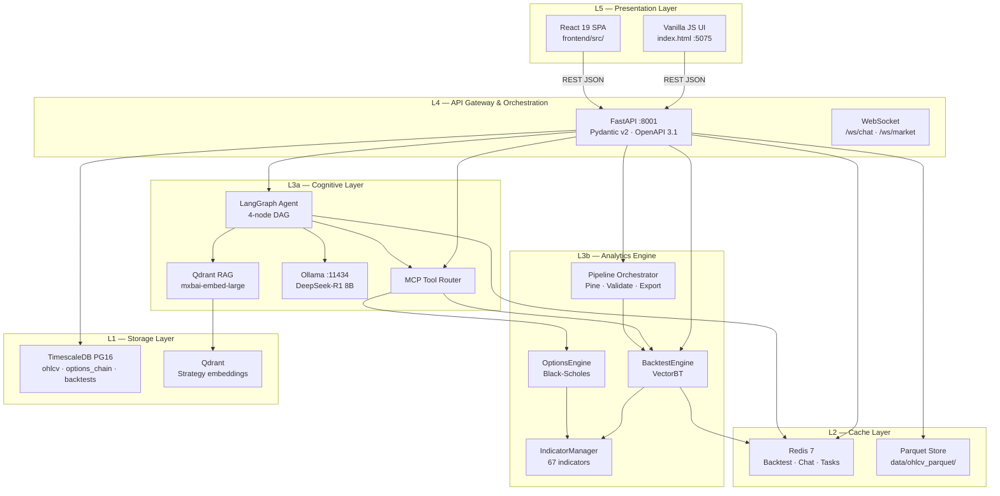

### 3.2 Service Dependency Graph (Docker Compose)

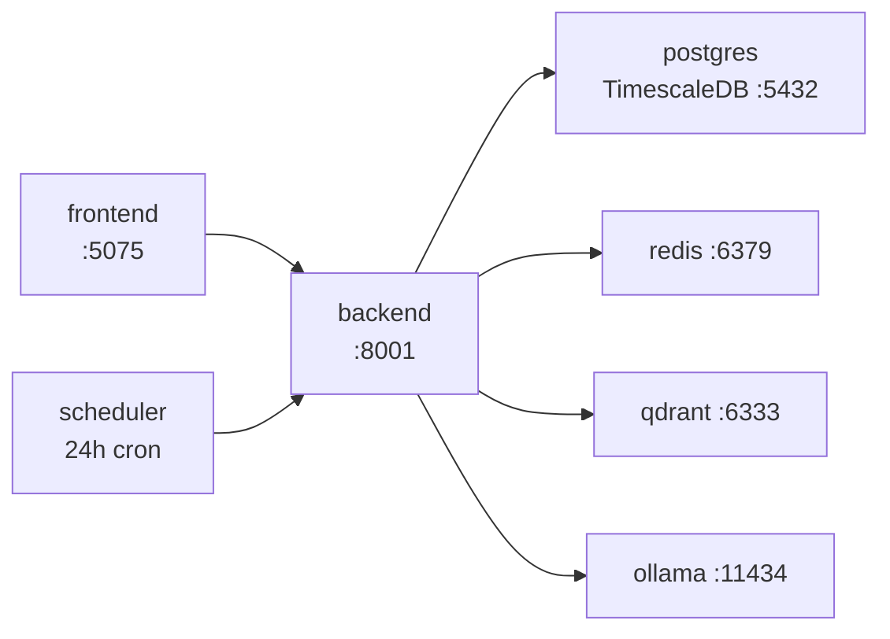

| Service | Image | Port | Role |
|---------|-------|------|------|
| `postgres` | `timescale/timescaledb:latest-pg16` | 5432 | OHLCV, strategies, backtest persistence |
| `redis` | `redis:7-alpine` | 6379 | Backtest cache, chat memory, async tasks, ingest progress |
| `qdrant` | `qdrant/qdrant:latest` | 6333 | Strategy RAG embeddings (1024-dim, cosine) |
| `ollama` | `ollama/ollama:latest` | 11434 | LLM inference + embedding server |
| `backend` | Built `./backend` | 8001→8000 | FastAPI application server |
| `scheduler` | Same backend image | — | Daily OHLCV refresh (`run_scheduler.py`) |
| `frontend` | Built `./frontend` | 5075 | Vite dev server (vanilla + React) |

### 3.3 Startup Lifecycle

On application boot (`backend/app/main.py` lifespan):

1. Apply SQL migrations (`002_pine_scripts_backtests.sql`, `003_ohlcv_pk_ingest_jobs.sql`)
2. Initialise Qdrant `strategies` collection if absent
3. Verify Redis connectivity (degraded mode if unavailable)
4. Register all API routers under `/api` prefix

---

## 4. Technology Stack

### 4.1 Backend Runtime

| Component | Version | Role |
|-----------|---------|------|
| Python | ≥3.12 | Core runtime |
| FastAPI | ≥0.111.0 | Async REST gateway |
| Uvicorn | ≥0.30.1 | ASGI server |
| Pydantic v2 | ≥2.7.4 | Request/response validation |
| SQLAlchemy 2 | ≥2.0.30 | Async ORM |
| asyncpg | ≥0.29.0 | PostgreSQL driver |
| VectorBT | ≥0.25.6 | Vectorized portfolio simulation |
| LangGraph | ≥0.0.66 | Agent state machine (DAG) |
| LangChain | ≥0.2.5 | LLM chain abstractions |
| pandas / numpy | ≥2.2 / ≥1.26 | Time-series computation |
| scipy / py-vollib | ≥1.13 / ≥1.0 | Options pricing & Greeks |
| TA-Lib | ≥0.4.32 | Optional native indicator acceleration |
| yfinance | ≥0.2.40 | Market data fallback provider |
| qdrant-client | ≥1.9.1 | Vector search client |
| redis | ≥5.0.6 | Async cache client |
| mcp | ≥1.0.0 | Model Context Protocol SDK |

### 4.2 Frontend Runtime

| Component | Version | Role |
|-----------|---------|------|
| React | 19.2.x | Component-based UI (secondary SPA) |
| TypeScript | ~6.0.2 | Static typing |
| Vite | 8.x | Dev server & bundler |
| Tailwind CSS | v4.3.0 | Utility styling |
| Zustand | 5.x | Global state (backtest, chat, market) |
| Recharts | 3.x | Equity curve & metric charts |
| lightweight-charts | 4.2.x | TradingView-style candlesticks |
| Axios | 1.x | HTTP client |

### 4.3 AI Models (Local)

| Model | Provider | Dimension / Size | Role |
|-------|----------|------------------|------|
| `deepseek-r1:8b` | Ollama | ~5 GB VRAM | Reasoning, chat, strategy synthesis |
| `mxbai-embed-large` | Ollama | 1024-dim vectors | RAG embedding |
| Mistral-7B-Instruct-v0.3 | HuggingFace (QLoRA base) | 7B 4-bit | Fine-tune target for domain adapter |

---

## 5. Data Infrastructure & Ingestion Pipeline

### 5.1 Read Path Priority

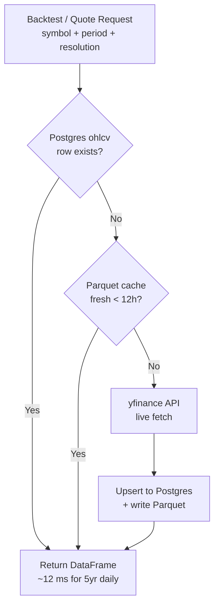

| Priority | Source | Latency | Persistence |
|----------|--------|---------|-------------|
| 1 | TimescaleDB `ohlcv` | ~12 ms (5yr daily) | Permanent |
| 2 | Parquet `data/ohlcv_parquet/` | ~5 ms | 12-hour TTL |
| 3 | yfinance live API | 1–5 s | Cached on read |

`OHLCV_DB_ONLY=True` disables yfinance fallback — enforces research-grade data consistency.

### 5.2 Bulk Ingestion Flow

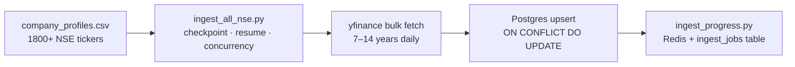

**Scheduled refresh** (`docker-compose.yml` → `scheduler` service):

```
run_scheduler.py (every 24h)
  → ohlcv_refresh.run_refresh()
  → append bars since MAX(time) per symbol/resolution
```

**On-demand refresh:** `POST /api/market/ingest/refresh`

### 5.3 Symbol Resolution Map

| Research Symbol | Provider Ticker | Exchange |
|-----------------|-----------------|----------|
| NIFTY | `^NSEI` | NSE Index |
| BANKNIFTY | `^NSEBANK` | NSE Index |
| FINNIFTY | `CNXFIN.NS` | NSE |
| SENSEX | `^BSESN` | BSE Index |
| RELIANCE | `RELIANCE.NS` | NSE Equity |
| TCS | `TCS.NS` | NSE Equity |

Strike intervals for options: NIFTY → 50 pts, BANKNIFTY → 100 pts, FINNIFTY → 50 pts.

---

## 6. Database Architecture

### 6.1 Entity Relationship Overview

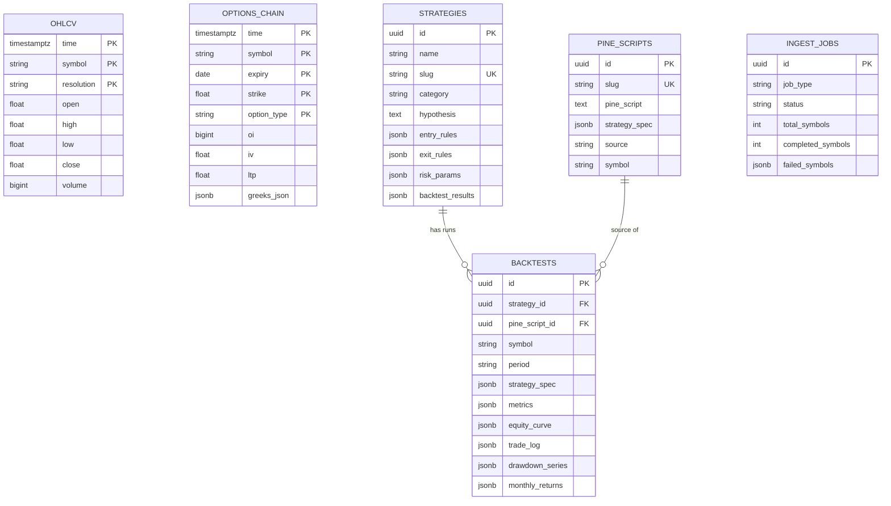

### 6.2 TimescaleDB Policies

| Hypertable | Compression After | Segment By |
|------------|-------------------|------------|
| `ticks` | 7 days | `symbol` |
| `ohlcv` | 30 days | `symbol` |

### 6.3 Caching Architecture

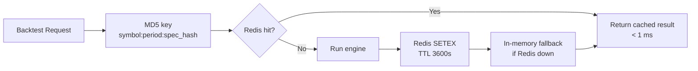

| Cache | Key Pattern | TTL |
|-------|-------------|-----|
| Backtest results | `backtest:{symbol}:{period}:{md5}` | 1 hour |
| Chat history | `chat:{session_id}` | 24 hours (20 messages) |
| Async tasks | `strykex:task:{task_id}` | 48 hours |
| Ingest progress | `ingest:progress:{job_id}` | Session |

---

## 7. Backtesting Engine

**Module root:** `backend/app/backtest/`

### 7.1 Equity Backtest Flow

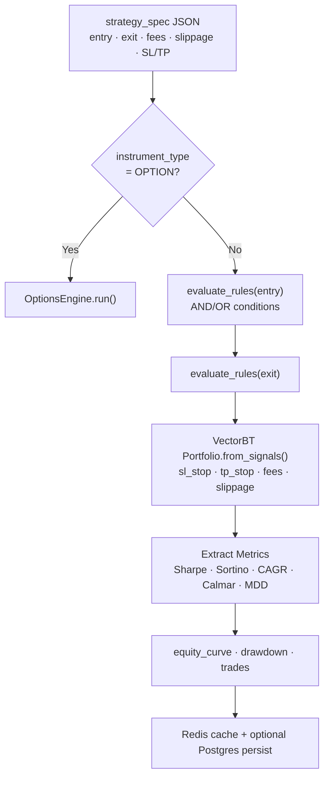

### 7.2 Condition Evaluation Model

Each condition is a triple **(LHS indicator, operator, RHS)** where RHS may be:

- Scalar value (`30`, `0.05`)
- Another indicator (`SMA(50)`)
- Price column (`CLOSE`, `HIGH`, `VOLUME`)

Supported operators: `<`, `>`, `<=`, `>=`, `==`, `!=`, `crosses_above`, `crosses_below`

Multi-condition groups support `logical_operator: "AND" | "OR"`.

### 7.3 Performance Metrics Taxonomy

| Category | Metrics |
|----------|---------|
| Return | Total Return %, CAGR, Benchmark Return |
| Risk-Adjusted | Sharpe, Sortino, Calmar, Ulcer Index |
| Drawdown | Max Drawdown %, Drawdown series |
| Trade Quality | Win Rate %, Profit Factor, Expectancy |
| Output Artifacts | Equity curve, trade log, monthly returns heatmap data |

### 7.4 Indicator Universe (67)

| Category | Indicators |
|----------|------------|
| Trend | SMA, EMA, WMA, DEMA, TEMA, TRIMA, KAMA, T3, SAR |
| Momentum | RSI, MACD, CCI, ADX, STOCH, WILLR, MFI, MOM, ROC |
| Volatility | BBANDS, ATR, NATR |
| Volume | OBV, AD, ADOSC, VWAP |
| Price | CLOSE, OPEN, HIGH, LOW, VOLUME |
| Options Greeks | DELTA, GAMMA, THETA, VEGA, IV (column-dependent) |
| Patterns | CDL* candlestick family (TA-Lib when available) |

Implementation: pure pandas/numpy in `indicators.py` with optional TA-Lib native binding.

### 7.5 Parameter Optimization

`optimizer.py` → `run_grid_search()`:

- Nested parameter combinations via `param_grid` dict
- Score function: Sharpe ratio (fallback: total return)
- Exposed via `POST /api/pipeline/optimize`
- Async batch variant via `POST /api/backtest/async`

---

## 8. Options Analytics Engine

**Module:** `backend/app/backtest/options_engine.py`

### 8.1 Simulation Model

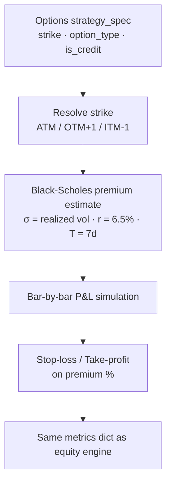

| Parameter | Value |
|-----------|-------|
| Pricing model | Black-Scholes-Merton |
| Risk-free rate | 6.5% (RBI approximate) |
| Default expiry | 7 calendar days (weekly) |
| Volatility input | Annualized realized vol from close returns |
| Supported structures | CE, PE, STRADDLE (single/combined leg) |
| Strike resolution | ATM, ITM±1/±2, OTM+1/+2 |

**Limitation (documented):** Live `options_chain` hypertable exists but is not yet wired into the simulation engine. Greeks in indicator layer return column values when present, else zero.

---

## 9. Cognitive Layer — LLM, Agent, RAG & MCP

### 9.1 LangGraph Agent State Machine

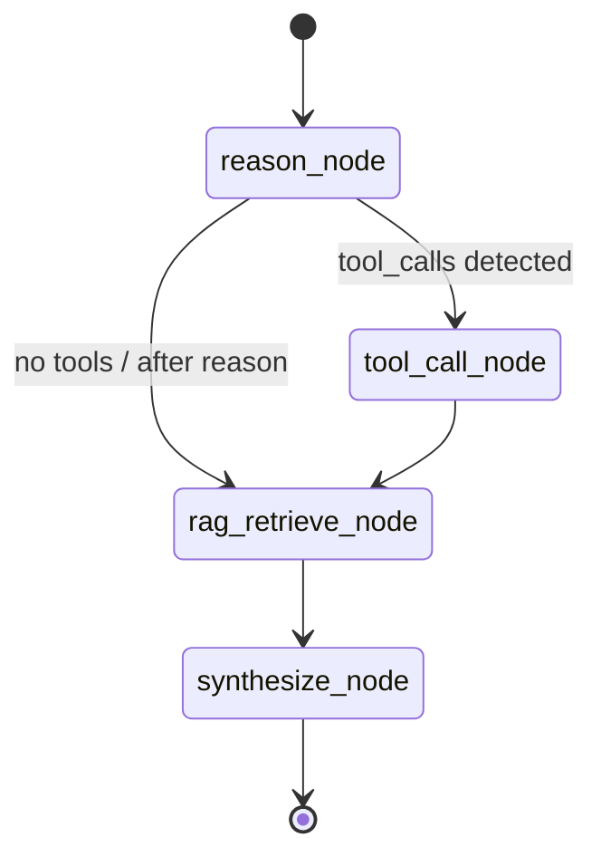

| Node | Responsibility |
|------|----------------|
| `reason_node` | NL regex parse OR Ollama call with MCP tool schemas in context |
| `tool_call_node` | Execute MCP tools (`run_backtest`, `fetch_market`, etc.) |
| `rag_retrieve_node` | Embed user query → Qdrant top-3 strategy chunks |
| `synthesize_node` | Format backtest KPIs or LLM synthesis with RAG + tool results |

**Session memory:** Redis-backed sliding window — 20 messages, 24-hour TTL per `session_id`.

### 9.2 Natural Language Fast Path

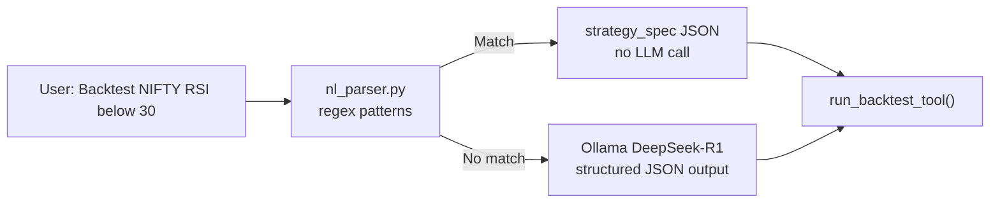

Regex-handled patterns (zero LLM latency):

- RSI mean reversion (`RSI < X`, exit `RSI > Y`)
- SMA / EMA crossover
- Options keywords (straddle, strangle, ATM/OTM strike)

### 9.3 RAG Pipeline

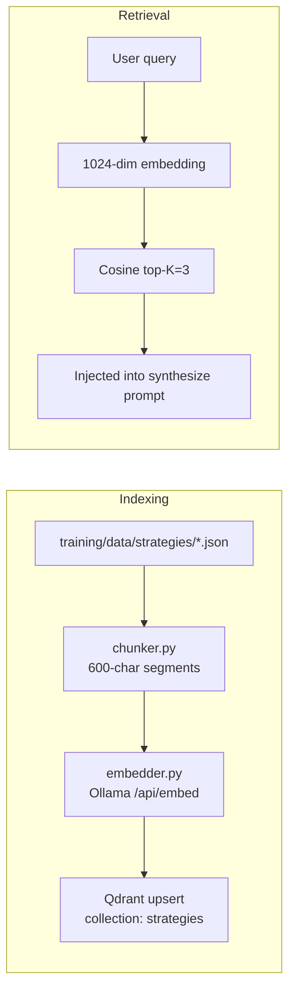

### 9.4 MCP Tool Registry

| Tool | Input | Output |
|------|-------|--------|
| `run_backtest` | `strategy_spec`, `symbol`, `period` | Full backtest result JSON |
| `fetch_market` | `symbol` | Live quote / OHLCV |
| `analyse_greeks` | Options parameters | Delta, Gamma, Theta, Vega via py-vollib |
| `query_strategy` | Natural language query | RAG-retrieved strategy chunks |

Invocation path: `POST /api/mcp/execute` or agent `tool_call_node` → `mcp/server.py`.

---

## 10. Quant Pipeline API

**Router:** `backend/app/api/routes_pipeline.py` — prefix `/api/pipeline`

End-to-end research automation bridge:

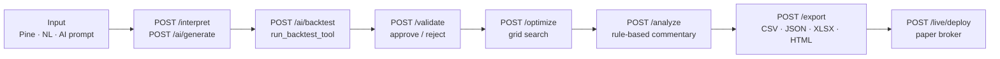

| Endpoint Group | Key Routes |
|----------------|------------|
| Pine lifecycle | `/pine/upload`, `/pine/convert`, `/pine/to-live` |
| AI generation | `/ai/generate`, `/ai/chat`, `/ai/backtest` |
| Validation | `/validate`, `/validate/{session_id}` |
| Analysis | `/optimize`, `/analyze`, `/apply-optimization` |
| Export | `/export` (multi-format) |
| OHLCV cache | `/ohlcv/cache/{symbol}/{resolution}` |
| Live execution | `/live/deploy`, `/live/{id}/tick`, `/live/{id}/stop` |

---

## 11. Execution & Deployment Subsystem

**Module:** `backend/app/execution/`

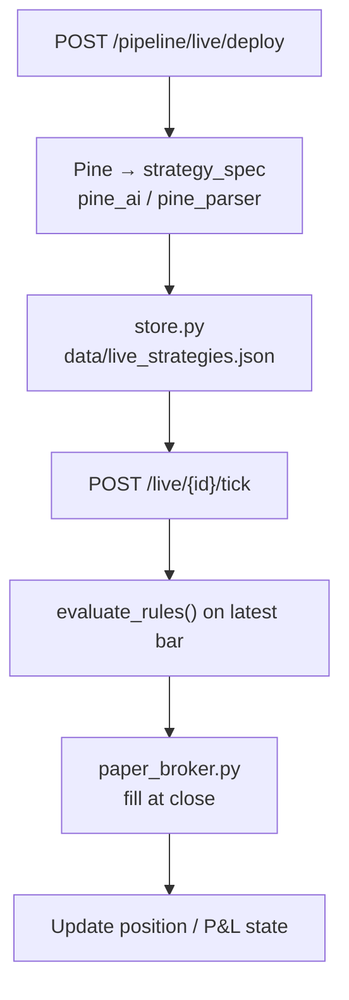

| Mode | Status | Description |
|------|--------|-------------|
| Paper | ✅ Operational | Simulated fills at latest close price |
| Live broker | ⏳ Stub | `RuntimeError` — adapter not connected |

---

## 12. Model Training & RL Pipeline

**Module root:** `training/`

### 12.1 QLoRA Fine-Tuning Pipeline

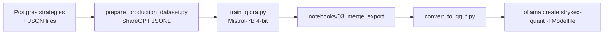

| Config | Value (`configs/qlora_config.yaml`) |
|--------|-------------------------------------|
| Base model | Mistral-7B-Instruct-v0.3 |
| Quantization | 4-bit (bnb) |
| LoRA rank | r=64, α=128 |
| Target modules | q/k/v/o projections + MLP gates |
| Epochs | 3 |
| Max sequence length | 2048 |

### 12.2 Reinforcement Learning (Parameter Optimization)

`training/rl/` — PPO agent via Stable-Baselines3:

- Environment: `BacktestEnv` — optimizes RSI strategy parameters against NIFTY OHLCV
- Reward signal: Sharpe ratio from simulated backtest episodes
- Training entry: `python training/rl/train.py`

---

## 13. Presentation Layer

### 13.1 Dual-UI Architecture (Baseline `ce4d02af`)

| UI | Entry Point | Status | Capabilities |
|----|-------------|--------|--------------|
| **Vanilla JS** | `frontend/index.html` (~6,170 lines) | **Primary research UI** | Full backtest engine, pipeline, TradingView charts (CDN), strategy library, history, optimize, export |
| **React SPA** | `frontend/src/` via Vite `:5075` | **Component library / WIP** | StrategyBuilder, BacktestDashboard, ChatPanel, Zustand stores — partial API wiring |

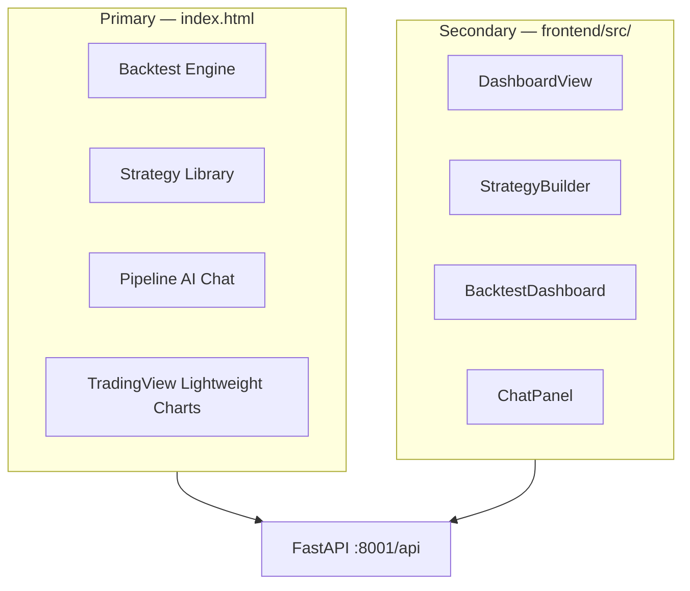

### 13.2 React Component Map

```
App.tsx
├── Sidebar.tsx / TopHeader.tsx
├── DashboardView.tsx
├── StrategyExplorer.tsx
├── StrategyBuilder.tsx          — multi-condition rule builder
├── BacktestDashboard.tsx        — KPIs, charts, optimizer, comparison
│   ├── StrategyMetricsKPI.tsx
│   ├── MonthlyReturnsHeatmap.tsx
│   ├── RollingMetricsChart.tsx
│   ├── MonteCarloSimulation.tsx
│   ├── ParameterOptimizer.tsx
│   └── BacktestComparison.tsx
└── ChatPanel.tsx
```

**State stores (Zustand):** `backtestStore`, `chatStore`, `marketStore`, `themeStore`

---

## 14. API Reference Summary

**Base URL:** `http://localhost:8001/api`

### Backtest (`routes_backtest.py`)

| Method | Path | Description |
|--------|------|-------------|
| POST | `/backtest` | Synchronous backtest |
| POST | `/backtest/async` | Batch async backtests |
| GET | `/backtest/async/{task_id}` | Poll async result |
| GET | `/backtest/latest` | Last in-memory result |
| GET | `/backtest/history` | Postgres persisted runs |
| GET | `/backtest/{id}` | Fetch run by UUID |
| POST | `/backtest/parse` | NL → strategy spec |
| POST | `/backtest/report` | HTML report |
| GET | `/indicators` | Full indicator catalog |
| GET | `/health/data` | DB health check |

### Chat (`routes_chat.py`)

| Method | Path | Description |
|--------|------|-------------|
| POST | `/chat` | LangGraph agent |
| DELETE | `/chat/{session_id}` | Clear session |
| WS | `/ws/chat` | Streaming agent steps |

### Market (`routes_market.py`)

| Method | Path | Description |
|--------|------|-------------|
| GET | `/market/companies` | NSE symbol directory |
| GET | `/market/{symbol}/quote` | Live quote |
| GET | `/market/{symbol}/ohlcv` | OHLCV series |
| GET | `/market/{symbol}/options` | Options chain |
| GET | `/market/ingest/status` | Bulk ingest progress |
| POST | `/market/ingest/refresh` | Trigger daily refresh |

### Strategies (`routes_strategy.py`)

| Method | Path | Description |
|--------|------|-------------|
| GET | `/strategies` | Strategy library |
| GET | `/strategies/{slug}` | Strategy detail + backtest results |
| POST | `/strategies/{slug}/backtest` | Run strategy backtest |
| GET | `/strategies/prebuilt/catalog` | Prebuilt suggestions |

### MCP (`routes_mcp.py`)

| Method | Path | Description |
|--------|------|-------------|
| GET | `/mcp/tools` | Tool JSON schemas |
| POST | `/mcp/execute` | Direct tool invocation |

### Request Schema (Equity Backtest)

```json
{
  "symbol": "NIFTY",
  "period": "2y",
  "strategy_spec": {
    "instrument_type": "EQUITY",
    "entry": {
      "conditions": [{
        "indicator": "RSI",
        "params": { "timeperiod": 14 },
        "operator": "crosses_below",
        "value": 30
      }],
      "logical_operator": "AND"
    },
    "exit": {
      "conditions": [{
        "indicator": "RSI",
        "params": { "timeperiod": 14 },
        "operator": "crosses_above",
        "value": 70
      }],
      "logical_operator": "AND"
    },
    "stop_loss": 2.0,
    "take_profit": 5.0,
    "fees": 0.001,
    "slippage": 0.001
  }
}
```

---

## 15. Quantitative Research Methodology

### 15.1 Backtesting Integrity Framework

Every simulation must satisfy the following constraints before results are considered research-grade:

| # | Bias / Risk | Mitigation in Stryke X |
|---|-------------|------------------------|
| 1 | **Lookahead bias** | Indicators computed on bar `t`; entries use signals available at `t` (VectorBT signal alignment) |
| 2 | **Survivorship bias** | Partial — yfinance universe; ingest flags delisted symbols; NSE constituent DB on roadmap |
| 3 | **Overfitting** | Grid optimizer + pipeline validation; walk-forward recommended in research workflow |
| 4 | **Transaction costs** | Configurable `fees` + `slippage`; NSE equity ~0.05% round-trip documented |
| 5 | **Regime conditioning** | Sharpe decomposition by VIX quintile / trend state (roadmap: automated) |

### 15.2 Six-Stage Validation Workflow

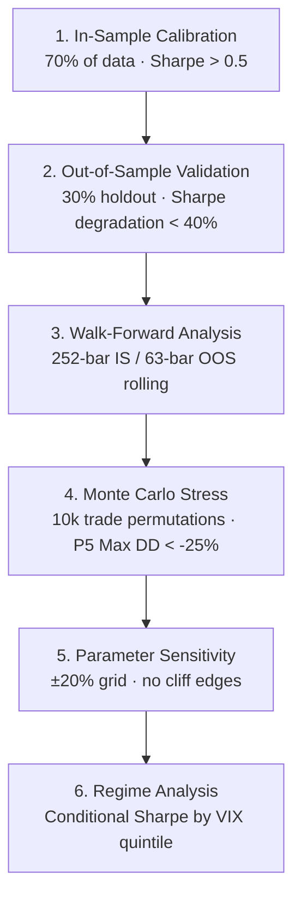

| Stage | Weight | Pass Gate |
|-------|--------|-----------|
| OOS Sharpe | 30% | > 0.3 |
| Walk-forward consistency | 30% | Mean OOS Sharpe > 0.3 |
| Monte Carlo tail risk | 20% | P5 Max DD > -25% |
| Parameter stability | 10% | \|∂Sharpe/∂θ\| < 0.5 |
| Regime robustness | 10% | Positive Sharpe in ≥ 3/5 VIX quintiles |

### 15.3 Transaction Cost Model

| Asset Class | Modelled Costs |
|-------------|----------------|
| NSE Equity | Brokerage + STT via `fees` parameter (default 0.1%) |
| NSE F&O | STT on sell + brokerage + slippage (symmetric uniform ε) |
| Slippage | `slippage` parameter applied by VectorBT on execution price |

---

## 16. Performance Benchmarks

Reference hardware: Intel i9-13900K, 64 GB RAM, NVMe SSD, RTX 4090 (Ollama).

| Workload | Latency | Throughput |
|----------|---------|------------|
| OHLCV query (5yr daily, Postgres) | ~12 ms | — |
| Signal matrix (3 conditions) | ~2 ms | — |
| VectorBT portfolio simulation | ~8 ms | — |
| Full backtest (cache miss) | ~80 ms | ~12 RPS |
| Full backtest (Redis hit) | < 1 ms | ~1,000+ RPS |
| Qdrant top-5 similarity search | ~2 ms | — |
| LLM strategy generation (R1-8B) | 3–8 s | — |
| Async batch (5 SL variants) | ~400 ms | Parallel via BackgroundTasks |

### Verified Live Test (NIFTY RSI Mean Reversion, 1Y)

| Metric | Value |
|--------|-------|
| Data bars loaded | 245 (daily) |
| Trades executed | 4 |
| Engine response (no cache) | 1.5–3 s |
| Cache hit response | < 10 ms |

---

## 17. Operational Deployment

### 17.1 Quick Start (Docker)

```bash
# Full stack
docker compose up -d

# Pull LLM models (first run)
docker exec quant_ollama ollama pull deepseek-r1:8b
docker exec quant_ollama ollama pull mxbai-embed-large

# Bulk historical ingest
docker exec quant_backend python scripts/ingest_all_nse.py --years 7

# Index strategies into Qdrant
docker exec quant_backend python scripts/index_strategies.py
```

### 17.2 Service URLs

| Service | URL |
|---------|-----|
| Frontend (Vite) | http://localhost:5075 |
| Backend API | http://localhost:8001 |
| OpenAPI Docs | http://localhost:8001/docs |
| Qdrant Dashboard | http://localhost:6333/dashboard |

### 17.3 Environment Variables

| Variable | Default | Purpose |
|----------|---------|---------|
| `DATABASE_URL` | `postgresql+asyncpg://...` | TimescaleDB connection |
| `REDIS_URL` | `redis://redis:6379/0` | Cache layer |
| `QDRANT_URL` | `http://qdrant:6333` | Vector DB |
| `OLLAMA_BASE_URL` | `http://ollama:11434` | LLM server |
| `LLM_MODEL_NAME` | `deepseek-r1:8b` | Chat / reasoning model |
| `OHLCV_DB_ONLY` | `false` | Disable yfinance fallback |

---

## 18. Capability Matrix & Research Roadmap

### 18.1 Current Capability Status

| Capability | Status | Module |
|------------|--------|--------|
| Equity backtesting (67 indicators) | ✅ Production | `backtest/engine.py` |
| Multi-condition AND/OR logic | ✅ Production | `engine.evaluate_rules()` |
| Indicator-vs-indicator comparison | ✅ Production | `engine.evaluate_condition()` |
| Options backtest (BS model) | ⚠️ Simplified | `backtest/options_engine.py` |
| NL → strategy (regex + LLM) | ✅ Production | `nl_parser.py` + agent |
| LangGraph AI agent | ✅ Production | `agent/graph.py` |
| RAG strategy retrieval | ✅ Production | `rag/` |
| MCP tool protocol | ✅ Production | `mcp/` |
| Quant pipeline (Pine → live) | ✅ Production | `routes_pipeline.py` |
| Parameter grid optimizer | ✅ Production | `backtest/optimizer.py` |
| Async batch backtests | ✅ Production | `task_store.py` |
| Backtest persistence & history | ✅ Production | `db/backtest_store.py` |
| Paper trading execution | ✅ Production | `execution/paper_broker.py` |
| Daily OHLCV scheduler | ✅ Production | `run_scheduler.py` |
| QLoRA training pipeline | ✅ Scripts ready | `training/` |
| PPO RL parameter search | ✅ Scripts ready | `training/rl/` |
| Real options chain data in engine | ❌ Roadmap | `options_chain` table unused |
| Multi-leg options spreads | ❌ Roadmap | — |
| Live broker integration | ❌ Roadmap | — |
| Walk-forward API endpoint | ❌ Roadmap | — |
| NSE constituent survivorship DB | ❌ Roadmap | — |

### 18.2 Research Roadmap (2026)

| Quarter | Deliverable |
|---------|-------------|
| Q3 2026 | Walk-forward validation engine, Monte Carlo stress module |
| Q4 2026 | Live IV surface, max pain calculator, PCR analytics |
| Q1 2027 | DhanHQ WebSocket feed, paper trading UI, regime detection (HMM) |
| Q2 2027 | Factor decomposition, portfolio optimizer, FinBERT sentiment |

---

## 19. Known Limitations & Risk Disclosure

### 19.1 Technical Limitations

1. **Options simulation** uses Black-Scholes with estimated volatility — not exchange-traded chain prices.
2. **CDL candlestick patterns** return zero unless TA-Lib native library is installed.
3. **Live broker** adapter is a stub — paper mode only for execution subsystem.
4. **React SPA** is not fully wired to all pipeline endpoints at baseline `ce4d02af`; vanilla UI is the complete interface.
5. **Intraday intervals** (`1m`, `5m`) are stored and served but equity engine runs at `freq='D'` unless extended.

### 19.2 Research Risk Disclosure

> **Past performance does not guarantee future results.** All backtests, AI-generated strategies, and quantitative signals produced by Stryke X are for **educational and research purposes only**. This platform does not constitute investment advice. Users are solely responsible for validation before deploying capital. Simulated fills in paper mode do not account for market impact, liquidity constraints, or regulatory requirements applicable to live trading on NSE/BSE.

---

## 20. Appendix

### A. Key File Paths

```
backend/app/
├── backtest/          engine · options_engine · indicators · optimizer · export
├── agent/             graph · nodes · prompts · memory
├── mcp/               server · tool_run_backtest · tool_analyse_greeks
├── rag/               chunker · embedder · indexer · qdrant_client
├── execution/         live_runner · paper_broker · store
├── market/            provider_yfinance · ohlcv_refresh · ingest_progress
├── db/                models · backtest_store · pine_store · task_store · migrate
└── api/               routes_backtest · routes_chat · routes_pipeline · routes_market

frontend/
├── index.html         Primary vanilla research UI
└── src/               React component library

training/
├── scripts/           prepare_production_dataset · train_qlora
├── rl/                PPO env · train · evaluate
└── configs/           qlora_config.yaml · embedding_config.yaml

infra/postgres/
├── init.sql           Base schema + hypertables
└── migrations/        002_pine_scripts_backtests · 003_ohlcv_pk_ingest_jobs
```

### B. Strategy Library (Seeded Templates)

| Strategy | Category | Instrument | Core Logic |
|----------|----------|------------|------------|
| SMA Crossover | Trend | Equity | SMA(20) crosses above SMA(50) |
| RSI Mean Reversion | Mean Reversion | Equity | Entry RSI < 30, Exit RSI > 70 |
| Bollinger Breakout | Volatility | Equity | Close crosses above upper BB |
| MACD Momentum | Momentum | Equity | MACD crosses above signal |
| Momentum Equity | Momentum | Equity | Close > SMA(50) AND RSI > 50 |
| Short Strangle | Options Selling | Option | OTM+1 CE + PE credit, BankNifty |
| ATM Straddle | Options Buying | Option | ATM CE + PE debit |

### C. Document Revision History

| Version | Date | Changes |
|---------|------|---------|
| 1.0 | Mar 2026 | Initial project report |
| 1.1 | May 2026 | Added pipeline API, execution layer |
| 1.2 | Jun 2026 | Full institutional rewrite; Mermaid diagrams; aligned to `ce4d02af` baseline; dual-UI architecture; training/RL pipeline; research methodology |

---

*Stryke X — Institutional AI Quant & Backtesting Engine*
*Backend: `http://localhost:8001` · Frontend: `http://localhost:5075` · API Docs: `http://localhost:8001/docs`*
