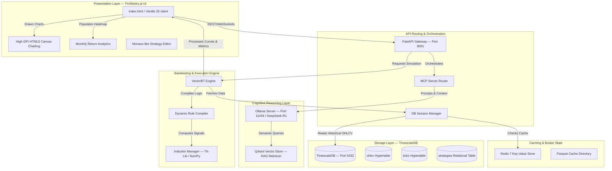

# Stryke X — Institutional AI Quant & Backtesting Engine
> Powered by the FinStocks.ai Unified Design System

Stryke X is an institutional-grade, AI-agentic quantitative backtesting and research platform engineered for Indian derivatives markets (Nifty 50, Bank Nifty). The platform integrates deep LLM reasoning, Model Context Protocol (MCP) tool orchestration, Vectorized Backtesting (VectorBT), and TimescaleDB-backed financial data infrastructure to facilitate rapid strategy formulation, validation, and analytics.

---

## 🏛️ System Architecture & Data Flow

Stryke X operates on a decoupled multi-layered architecture designed for ultra-low latency strategy compilation and high-throughput backtesting.



---

## 🛠️ Technology Stack

| Component | Technology | Description |
|---|---|---|
| **Core Web App** | HTML5, Vanilla JavaScript, CSS Variables | Customized to the **FinStocks.ai** dark design system. |
| **API Framework** | FastAPI (Python 3.12) | High-performance, asynchronous REST and WebSocket API. |
| **Vector Engine** | VectorBT (`vectorbt`) | Vectorized portfolio simulation using NumPy and Pandas. |
| **Technical Indicators** | NumPy, Pandas, TA-Lib | Optimized calculations for 100+ indicators. |
| **Model serving** | Ollama (Development), vLLM (Production) | Local execution of reasoning models (DeepSeek-R1, Mistral). |
| **Vector Database** | Qdrant | RAG engine for semantic strategy retrieval. |
| **Embeddings** | BGE-M3 (1024 Dimensions) | Multi-stage text embedding model. |
| **Historical Storage** | TimescaleDB (PostgreSQL 16) | Time-series optimized hypertable storage for tick and bar data. |
| **Caching Layer** | Redis 7 | Sub-millisecond backtest state and JSON response caching. |

---

## 🗄️ Database Schemas & Data Model

Stryke X leverages **TimescaleDB** extensions to manage time-series tick and OHLCV data. 

### 1. `ohlcv` (Hypertable)
Stores time-series price bars partitioned by `time` with automatic 30-day compression policies.
```sql
CREATE TABLE IF NOT EXISTS ohlcv (
    time TIMESTAMPTZ NOT NULL,
    symbol TEXT NOT NULL,
    open DOUBLE PRECISION NOT NULL,
    high DOUBLE PRECISION NOT NULL,
    low DOUBLE PRECISION NOT NULL,
    close DOUBLE PRECISION NOT NULL,
    volume BIGINT,
    resolution TEXT NOT NULL -- '1m', '5m', '1h', '1d'
);
SELECT create_hypertable('ohlcv', 'time', if_not_exists => TRUE);
CREATE INDEX IF NOT EXISTS ix_ohlcv_symbol_res_time ON ohlcv (symbol, resolution, time DESC);
```

### 2. `strategies` (Relational Table)
Stores structured trading rules, natural-language hypotheses, risk parameters, and cached backtest results.
```sql
CREATE TABLE IF NOT EXISTS strategies (
    id UUID PRIMARY KEY DEFAULT gen_random_uuid(),
    name TEXT NOT NULL,
    slug TEXT UNIQUE NOT NULL,
    category TEXT NOT NULL,
    hypothesis TEXT,
    entry_rules JSONB, -- JSON representation of entries or rule condition string
    exit_rules JSONB,  -- JSON representation of exits or target parameters
    risk_params JSONB, -- SL, TP, Trail levels
    metadata JSONB,
    created_at TIMESTAMPTZ DEFAULT CURRENT_TIMESTAMP
);
CREATE INDEX IF NOT EXISTS ix_strategies_category ON strategies (category);
```

### 3. `options_chain` (Hypertable)
Stores historical option chains including implied volatility (IV), open interest (OI), and computed Greeks.
```sql
CREATE TABLE IF NOT EXISTS options_chain (
    time TIMESTAMPTZ NOT NULL,
    symbol TEXT NOT NULL,
    expiry DATE NOT NULL,
    strike DOUBLE PRECISION NOT NULL,
    option_type TEXT NOT NULL, -- 'CE' or 'PE'
    oi BIGINT,
    volume BIGINT,
    iv DOUBLE PRECISION,
    ltp DOUBLE PRECISION,
    greeks_json JSONB
);
SELECT create_hypertable('options_chain', 'time', if_not_exists => TRUE);
CREATE INDEX IF NOT EXISTS ix_options_chain_query ON options_chain (symbol, expiry, strike, time DESC);
```

---

## ⚡ Dynamic Strategy Compilation Engine

A core innovation in Stryke X is the **Dynamic Rule Compiler** (`backend/app/strategies/compiler.py`), which translates stored natural-language conditions into structured ASTs (Abstract Syntax Trees) compatible with the vectorbt vectorized signal generator.

### Parsing Flow
When a strategy is loaded, condition strings such as:
`"SMA(close, 5, 0) crosses below SMA(close, 20, 0)"`
are parsed using regular expressions:

```
                  ┌──────────────────────────────┐
                  │      Condition String        │
                  │ "SMA(close, 5) crosses below"│
                  └──────────────┬───────────────┘
                                 │
                                 ▼
                  ┌──────────────────────────────┐
                  │       Regex Splitter         │
                  │ Match operator: crosses_below│
                  └──────────────┬───────────────┘
                                 │
                 ┌───────────────┴───────────────┐
                 ▼                               ▼
       ┌──────────────────┐            ┌──────────────────┐
       │   Left Handler   │            │  Right Handler   │
       │  "SMA(close, 5)" │            │ "SMA(close, 20)" │
       └─────────┬────────┘            └─────────┬────────┘
                 │                               │
                 ▼                               ▼
       ┌──────────────────┐            ┌──────────────────┐
       │  AST Node (LHS)  │            │  AST Node (RHS)  │
       │ name: SMA        │            │ name: SMA        │
       │ params: period=5 │            │ params: period=20│
       └─────────┬────────┘            └─────────┬────────┘
                 │                               │
                 └───────────────┬───────────────┘
                                 │
                                 ▼
                 ┌───────────────────────────────┐
                 │       Compiled Spec           │
                 │  LHS: AST_Node (LHS)          │
                 │  operator: crosses_below      │
                 │  RHS: AST_Node (RHS)          │
                 └───────────────────────────────┘
```

The resulting dictionary is evaluated inside `BacktestEngine` by computing the Series arrays using `IndicatorManager` and applying logical bitwise masks (e.g. `(lhs > rhs) & (prev_lhs <= prev_rhs)` for crossovers).

---

## 📈 VectorBT Execution Pipeline

The backtest execution pipeline consists of four major stages:

1. **OHLCV Sourcing**:
   The engine calls the `YFinanceProvider`'s `get_ohlcv` method. If TimescaleDB is online, it queries the `ohlcv` table first. If the requested data is not found locally, it downloads it via yfinance and returns the structured Pandas DataFrame.
2. **Signal Matrix Calculation**:
   It calculates boolean matrices (`entries` and `exits`) by evaluating the compiled entry and exit conditions across all historical timestamps.
3. **Simulation**:
   The engine executes a vectorized portfolio simulation:
   ```python
   portfolio = vbt.Portfolio.from_signals(
       df['close'],
       entries,
       exits,
       sl_stop=stop_loss,
       tp_stop=take_profit,
       fees=0.001,
       slippage=0.001,
       freq='D'
   )
   ```
4. **Metrics Formulation**:
   It calculates CAGR, Sharpe Ratio, Sortino Ratio, Maximum Drawdown, Win Rate, and formats the transaction logs into a JSON response.

---

## 🚀 Installation & Quick Start

### Prerequisites
* Docker & Docker Compose
* Python 3.12+ (Virtual environment recommended)
* TA-Lib C Library (required for `TA-Lib` python package wrapper)

### 1. Clone & Set Environment
```bash
git clone <repository-url>
cd "RAG-LLM-MCP-Strategy-Builder"
cp .env.example .env
```

### 2. Launch TimescaleDB & Core Services
Spin up the database, vector store, and caching instances:
```bash
docker compose up -d postgres redis qdrant
```

### 3. Ingest Historical Market Data
Run the historical ingestion script to populate 14 years of daily bar data for `NIFTY` and `BANKNIFTY` into the TimescaleDB hypertable:
```bash
docker exec -it quant_backend python scripts/ingest_historical.py
```

### 4. Seed Strategy Logics
Seed the database with the strategy templates:
```bash
docker exec -it quant_backend python scripts/seed_auto_strategies.py
docker exec -it quant_backend python seed_strategies.py
```

### 5. Running the Backend & Frontend
Launch the services:
* **Backend**: `uvicorn app.main:app --host 0.0.0.0 --port 8000` (port forwarded to `8001` on host via docker-compose)
* **Frontend**: `npm run dev` (running Vite at `http://localhost:5075/`)

---

## 📡 API Reference

### 1. Retrieve Strategy Templates
Returns combined database and file-based strategy templates, including compiled backtesting specs.

* **Endpoint**: `GET /api/strategies`
* **Response Example**:
```json
[
  {
    "name": "Golden Crossover (SMA)",
    "slug": "golden-crossover",
    "category": "Equity",
    "description": "Classic trend following strategy where a fast SMA crosses above a slow SMA.",
    "tags": ["Equity", "Database"],
    "backtest_results": {
      "total_return": 18.4,
      "win_rate": 62
    },
    "backtest_spec": {
      "instrument_type": "EQUITY",
      "entry": {
        "conditions": [
          {
            "indicator": "SMA",
            "params": {"timeperiod": 50},
            "operator": "crosses_above",
            "value": {
              "indicator": "SMA",
              "params": {"timeperiod": 200}
            }
          }
        ],
        "logical_operator": "AND"
      },
      "exit": {
        "conditions": [
          {
            "indicator": "SMA",
            "params": {"timeperiod": 50},
            "operator": "crosses_below",
            "value": {
              "indicator": "SMA",
              "params": {"timeperiod": 200}
            }
          }
        ],
        "logical_operator": "AND"
      },
      "stop_loss": 0.05,
      "take_profit": 0.15
    }
  }
]
```

### 2. Execute Backtest
Executes a vectorized historical simulation on the loaded OHLCV data.

* **Endpoint**: `POST /api/backtest`
* **Request Payload**:
```json
{
  "strategy_spec": {
    "instrument_type": "EQUITY",
    "entry": {
      "conditions": [
        {
          "indicator": "RSI",
          "params": {"timeperiod": 14},
          "operator": "<",
          "value": 30
        }
      ],
      "logical_operator": "AND"
    },
    "exit": {
      "conditions": [
        {
          "indicator": "RSI",
          "params": {"timeperiod": 14},
          "operator": ">",
          "value": 70
        }
      ],
      "logical_operator": "AND"
    },
    "stop_loss": 0.02,
    "take_profit": 0.05
  },
  "symbol": "NIFTY",
  "period": "5y"
}
```

* **Response Example**:
```json
{
  "symbol": "NIFTY",
  "period": "5y",
  "total_return": 134.21,
  "benchmark_return": 87.42,
  "cagr": 18.52,
  "calmar": 1.25,
  "sharpe": 1.15,
  "sortino": 1.48,
  "max_drawdown": -14.82,
  "win_rate": 68.20,
  "profit_factor": 1.62,
  "equity_curve": [
    {"date": "2021-06-15", "value": 100.0},
    {"date": "2021-06-16", "value": 100.5}
  ],
  "trades": [
    {
      "id": 1,
      "entry_date": "2021-07-20",
      "exit_date": "2021-08-05",
      "direction": "Long",
      "entry_price": 15600.0,
      "exit_price": 16380.0,
      "pnl": 780.0,
      "pnl_pct": 5.0
    }
  ]
}
```

---

## 🔒 License & Intellectual Notice

Private Proprietary Software. Reserved for institutional trading and quantitative validation. Unauthorized copying, distribution, or decompilation of any files within this repository is strictly prohibited.
