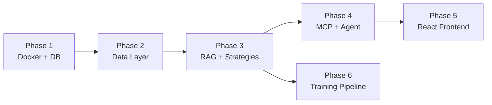

# Quant AI Agent — Full System Implementation Plan

A 5-layer institutional-grade AI agent for Indian markets (Nifty/BankNifty) with fine-tuned LLM reasoning, MCP tool orchestration, RAG-augmented strategy retrieval, live market data, and backtesting.

---

## User Review Required

> [!IMPORTANT]
> **This is a massive system (~80+ files across 5 layers).** I propose building it in 6 phases over multiple sessions. Each phase produces a working, testable subsystem. Approve this plan before I write any code.

> [!WARNING]
> **External service dependencies.** Several components require services running locally (PostgreSQL, Redis, Qdrant, Ollama). The Docker Compose file will handle orchestration, but you need Docker Desktop installed on Windows.

> [!IMPORTANT]
> **Fine-tuning (Layer 4) requires GPU access.** The LoRA/QLoRA training scripts are designed for Google Colab (A100) or Vast.ai. They will NOT run locally on a CPU-only machine. I'll generate Colab-ready notebooks.

---

## Open Questions

> [!IMPORTANT]
> **Q1: Do you already have strategy documents?** Your plan mentions strategies but the workspace is empty. I need to know:
> - Do you have existing strategy docs (PDFs, notes, spreadsheets) I should incorporate?
> - Or should I create **example/template** strategies (e.g., Short Strangle, Iron Condor, Straddle) as placeholder data so the full pipeline is demonstrable?

> [!IMPORTANT]
> **Q2: Which base LLM do you want to start with?**
> - **Mistral 7B v0.3** — Better instruction following, smaller community but cleaner architecture
> - **Llama 3.1 8B** — Larger community, more tooling support, Meta's latest
> - I'll default to **Mistral 7B** as your blueprint suggests, but can support either

> [!IMPORTANT]
> **Q3: Docker Desktop availability.** Is Docker Desktop already installed on your Windows machine? This determines whether I set up the infra with Docker Compose or provide manual installation instructions for PostgreSQL/Redis/Qdrant.

> [!WARNING]
> **Q4: NSE API access.** The NSE doesn't provide an official REST API — their website serves data via browser sessions with cookie-based auth. Options:
> - **Option A**: Use `jugaad-data` or `nsetools` Python packages (scrape-based, may break)
> - **Option B**: Use `yfinance` for all market data (reliable but 15-min delayed for Indian markets)
> - **Option C**: Integrate with a broker API (Zerodha Kite, Angel One SmartAPI) for real-time data
> - I'll build the abstraction layer to support **all three** with a fallback chain

> [!IMPORTANT]
> **Q5: TailwindCSS version.** Your blueprint specifies TailwindCSS. Which version?
> - **TailwindCSS v4** (latest, CSS-first configuration, no `tailwind.config.js`)
> - **TailwindCSS v3** (stable, JS-based config, more community resources)
> - I'll default to **v4** unless you prefer v3

---

## Project Directory Structure

```
d:\Projects\LLM Model\
├── docker-compose.yml                  # Orchestrates all services
├── .env                                # Environment variables (ports, keys, model paths)
├── .env.example                        # Template for .env
├── .gitignore
├── README.md
│
├── backend/                            # Layer 2 + 3: FastAPI + Agent
│   ├── pyproject.toml                  # Python dependencies (uv/pip)
│   ├── Dockerfile
│   ├── app/
│   │   ├── __init__.py
│   │   ├── main.py                     # FastAPI entrypoint, CORS, WebSocket
│   │   ├── config.py                   # Settings (Pydantic BaseSettings)
│   │   │
│   │   ├── api/                        # REST + WebSocket endpoints
│   │   │   ├── __init__.py
│   │   │   ├── routes_chat.py          # POST /chat, WS /ws/chat
│   │   │   ├── routes_market.py        # GET /market/{symbol}
│   │   │   ├── routes_strategy.py      # GET /strategies, GET /strategies/{id}
│   │   │   └── routes_backtest.py      # POST /backtest
│   │   │
│   │   ├── mcp/                        # Layer 2: MCP tool definitions
│   │   │   ├── __init__.py
│   │   │   ├── server.py               # MCP server setup
│   │   │   ├── tool_fetch_market.py    # fetch_market tool
│   │   │   ├── tool_query_strategy.py  # query_strategy tool (RAG)
│   │   │   ├── tool_run_backtest.py    # run_backtest tool (VectorBT)
│   │   │   └── tool_analyse_greeks.py  # analyse_greeks tool
│   │   │
│   │   ├── agent/                      # Layer 3: LLM Agent
│   │   │   ├── __init__.py
│   │   │   ├── graph.py                # LangGraph agent graph definition
│   │   │   ├── nodes.py                # Graph nodes (reason, tool_call, synthesize)
│   │   │   ├── state.py                # Agent state schema
│   │   │   ├── memory.py               # Redis conversation memory
│   │   │   └── prompts.py              # System prompts for the agent
│   │   │
│   │   ├── rag/                        # RAG retrieval layer
│   │   │   ├── __init__.py
│   │   │   ├── embedder.py             # BGE-M3 embedding wrapper
│   │   │   ├── qdrant_client.py        # Qdrant connection + search
│   │   │   ├── chunker.py              # Document chunking (500-800 tokens)
│   │   │   └── indexer.py              # Bulk index strategies into Qdrant
│   │   │
│   │   ├── market/                     # Market data providers
│   │   │   ├── __init__.py
│   │   │   ├── provider_base.py        # Abstract base class
│   │   │   ├── provider_nse.py         # NSE scraper/API
│   │   │   ├── provider_yfinance.py    # yfinance fallback
│   │   │   ├── provider_broker.py      # Broker API (Zerodha/Angel)
│   │   │   ├── cache.py                # Redis cache layer (1s TTL)
│   │   │   └── greeks.py               # Black-Scholes Greeks, IV, GEX
│   │   │
│   │   ├── backtest/                   # Backtesting engine
│   │   │   ├── __init__.py
│   │   │   ├── engine.py               # VectorBT wrapper
│   │   │   ├── strategies.py           # Strategy → VectorBT signal translator
│   │   │   └── metrics.py              # Sharpe, Sortino, Calmar, MaxDD
│   │   │
│   │   └── db/                         # Database layer
│   │       ├── __init__.py
│   │       ├── models.py               # SQLAlchemy models (OHLCV, strategies)
│   │       ├── session.py              # DB session factory
│   │       └── migrations/             # Alembic migrations
│   │
│   └── scripts/                        # Utility scripts
│       ├── ingest_historical.py        # Download OHLCV from yfinance → PostgreSQL
│       ├── index_strategies.py         # Chunk + embed strategies → Qdrant
│       └── seed_strategies.py          # Seed example strategy JSONs
│
├── frontend/                           # Layer 1: React Web App
│   ├── package.json
│   ├── vite.config.ts
│   ├── tailwind.config.ts              # (if TailwindCSS v3)
│   ├── tsconfig.json
│   ├── index.html
│   ├── Dockerfile
│   ├── public/
│   │   └── favicon.svg
│   ├── src/
│   │   ├── main.tsx
│   │   ├── App.tsx
│   │   ├── index.css                   # Global styles + Tailwind directives
│   │   │
│   │   ├── stores/                     # Zustand state management
│   │   │   ├── chatStore.ts            # Chat messages, streaming state
│   │   │   ├── marketStore.ts          # Live market data
│   │   │   ├── strategyStore.ts        # Strategy list + selected
│   │   │   └── backtestStore.ts        # Backtest results + equity curve
│   │   │
│   │   ├── components/                 # UI components
│   │   │   ├── layout/
│   │   │   │   ├── Sidebar.tsx
│   │   │   │   ├── Header.tsx
│   │   │   │   └── MainLayout.tsx
│   │   │   ├── chat/
│   │   │   │   ├── ChatPanel.tsx        # Main chat container
│   │   │   │   ├── MessageBubble.tsx    # Individual message
│   │   │   │   ├── ChatInput.tsx        # Input + send button
│   │   │   │   └── StreamingIndicator.tsx
│   │   │   ├── market/
│   │   │   │   ├── MarketDashboard.tsx  # Live price cards
│   │   │   │   ├── PriceCard.tsx        # Individual index card
│   │   │   │   ├── OptionChainTable.tsx # Options chain display
│   │   │   │   └── SparklineChart.tsx   # Mini inline chart
│   │   │   ├── strategy/
│   │   │   │   ├── StrategyExplorer.tsx # Browse + filter strategies
│   │   │   │   ├── StrategyCard.tsx     # Strategy summary card
│   │   │   │   └── StrategyDetail.tsx   # Full strategy view
│   │   │   └── backtest/
│   │   │       ├── BacktestPanel.tsx    # Results container
│   │   │       ├── EquityCurve.tsx      # Recharts equity curve
│   │   │       ├── KPIGrid.tsx          # Sharpe/Sortino/MaxDD cards
│   │   │       └── DrawdownChart.tsx    # Underwater chart
│   │   │
│   │   ├── hooks/                      # Custom React hooks
│   │   │   ├── useWebSocket.ts         # WebSocket connection manager
│   │   │   ├── useChat.ts              # Chat logic + streaming
│   │   │   └── useMarketData.ts        # Market data subscription
│   │   │
│   │   ├── services/                   # API client layer
│   │   │   ├── api.ts                  # Axios/fetch client + base URL
│   │   │   ├── chatService.ts          # Chat API calls
│   │   │   ├── marketService.ts        # Market data API
│   │   │   ├── strategyService.ts      # Strategy CRUD
│   │   │   └── backtestService.ts      # Backtest API
│   │   │
│   │   └── types/                      # TypeScript interfaces
│   │       ├── chat.ts
│   │       ├── market.ts
│   │       ├── strategy.ts
│   │       └── backtest.ts
│
├── training/                           # Layer 4: Training Pipeline
│   ├── README.md
│   ├── notebooks/
│   │   ├── 01_prepare_dataset.ipynb    # Strategy → instruction tuning format
│   │   ├── 02_finetune_qlora.ipynb     # QLoRA fine-tuning on Colab
│   │   ├── 03_merge_export.ipynb       # Merge LoRA + export GGUF
│   │   └── 04_embed_index.ipynb        # Embed strategies → Qdrant
│   ├── data/
│   │   ├── strategies/                 # Raw strategy JSON files
│   │   │   ├── short_strangle.json
│   │   │   ├── iron_condor.json
│   │   │   ├── bull_put_spread.json
│   │   │   ├── straddle_earnings.json
│   │   │   └── _schema.json            # JSON schema for validation
│   │   ├── qa_pairs/                   # Generated instruction-tuning pairs
│   │   │   └── training_data.jsonl
│   │   └── market_notes/               # Optional market commentary
│   ├── scripts/
│   │   ├── generate_qa_pairs.py        # Auto-generate QA from strategy JSONs
│   │   ├── validate_strategies.py      # Validate against schema
│   │   └── convert_to_gguf.py          # Model format conversion
│   └── configs/
│       ├── qlora_config.yaml           # Training hyperparameters
│       └── embedding_config.yaml       # Chunking + embedding config
│
├── infra/                              # Layer 5: Infrastructure configs
│   ├── postgres/
│   │   └── init.sql                    # Schema: OHLCV hypertable, strategies table
│   ├── redis/
│   │   └── redis.conf                  # Redis configuration
│   ├── qdrant/
│   │   └── config.yaml                 # Qdrant collection config
│   └── nginx/
│       └── nginx.conf                  # Reverse proxy config (production)
```

---

## Proposed Changes

### Phase 1: Infrastructure Foundation (Layer 5)

This is the bedrock. Nothing else works without it.

---

#### [NEW] [docker-compose.yml](file:///d:/Projects/LLM%20Model/docker-compose.yml)
Defines all services:
- `postgres` — PostgreSQL 16 + TimescaleDB extension, port 5432
- `redis` — Redis 7, port 6379 
- `qdrant` — Qdrant vector DB, port 6333/6334
- `ollama` — Ollama model server, port 11434
- `backend` — FastAPI app, port 8000
- `frontend` — React dev server, port 5173
- Named volumes for persistence, shared network

#### [NEW] [.env.example](file:///d:/Projects/LLM%20Model/.env.example)
Template with all required environment variables:
- Database URLs, Redis URL, Qdrant URL
- Ollama model name, embedding model name
- API keys (if using broker APIs)
- Feature flags (enable/disable live market data)

#### [NEW] [infra/postgres/init.sql](file:///d:/Projects/LLM%20Model/infra/postgres/init.sql)
PostgreSQL schema:
- `ohlcv` hypertable — (timestamp, symbol, open, high, low, close, volume) partitioned by time
- `options_chain` — (timestamp, symbol, expiry, strike, option_type, oi, volume, iv, ltp, greeks_json)
- `strategies` — (id, name, slug, category, hypothesis, entry_rules, exit_rules, risk_params, backtest_results, metadata, created_at)
- Indexes on (symbol, timestamp), (symbol, expiry, strike)

#### [NEW] [infra/redis/redis.conf](file:///d:/Projects/LLM%20Model/infra/redis/redis.conf)
Redis config optimized for caching + pub/sub:
- `maxmemory 256mb`, `maxmemory-policy allkeys-lru`
- Pub/Sub channels for live market data broadcast

#### [NEW] [infra/qdrant/config.yaml](file:///d:/Projects/LLM%20Model/infra/qdrant/config.yaml)
Qdrant collection configuration:
- Collection: `strategies`, vector size: 1024 (BGE-M3 dim), distance: Cosine
- Payload indexing on `strategy_name`, `category`

---

### Phase 2: Data Layer + Ingestion (Layer 5 continued + Backend foundation)

---

#### [NEW] [backend/pyproject.toml](file:///d:/Projects/LLM%20Model/backend/pyproject.toml)
Python project config with dependencies:
- **Core**: fastapi, uvicorn, pydantic, python-dotenv
- **Database**: sqlalchemy, asyncpg, alembic
- **Market data**: yfinance, requests, aiohttp
- **Agent**: langchain, langgraph, langchain-community
- **RAG**: qdrant-client, sentence-transformers
- **Backtest**: vectorbt, pandas, numpy
- **Greeks**: scipy (Black-Scholes), py_vollib
- **Cache**: redis, aioredis

#### [NEW] [backend/app/config.py](file:///d:/Projects/LLM%20Model/backend/app/config.py)
Pydantic `BaseSettings` loading from `.env`:
- `DATABASE_URL`, `REDIS_URL`, `QDRANT_URL`, `OLLAMA_BASE_URL`
- `LLM_MODEL_NAME`, `EMBEDDING_MODEL_NAME`
- `MARKET_DATA_PROVIDER` (nse | yfinance | broker)

#### [NEW] [backend/app/db/models.py](file:///d:/Projects/LLM%20Model/backend/app/db/models.py)
SQLAlchemy ORM models mirroring the PostgreSQL schema:
- `OHLCV` — TimescaleDB hypertable model
- `OptionsChain` — Options snapshot model
- `Strategy` — Strategy knowledge base model

#### [NEW] [backend/app/db/session.py](file:///d:/Projects/LLM%20Model/backend/app/db/session.py)
Async SQLAlchemy session factory with connection pooling.

#### [NEW] [backend/app/market/provider_base.py](file:///d:/Projects/LLM%20Model/backend/app/market/provider_base.py)
Abstract base class defining the market data interface:
- `get_quote(symbol) → Quote`
- `get_ohlcv(symbol, interval, start, end) → DataFrame`
- `get_options_chain(symbol, expiry) → OptionsChain`

#### [NEW] [backend/app/market/provider_yfinance.py](file:///d:/Projects/LLM%20Model/backend/app/market/provider_yfinance.py)
yfinance implementation — reliable fallback for historical data.
Maps NSE symbols to yfinance tickers (e.g., `NIFTY 50` → `^NSEI`).

#### [NEW] [backend/app/market/provider_nse.py](file:///d:/Projects/LLM%20Model/backend/app/market/provider_nse.py)
NSE data provider using `requests` with browser-like headers.
Handles cookie/session management, retries, rate limiting.

#### [NEW] [backend/app/market/cache.py](file:///d:/Projects/LLM%20Model/backend/app/market/cache.py)
Redis-backed cache decorator:
- Live quotes: 1-second TTL
- OHLCV: 5-minute TTL
- Options chain: 30-second TTL

#### [NEW] [backend/app/market/greeks.py](file:///d:/Projects/LLM%20Model/backend/app/market/greeks.py)
Options Greeks computation:
- Black-Scholes pricing (calls + puts)
- Delta, Gamma, Theta, Vega, Rho
- Implied Volatility via Newton-Raphson
- IV Surface construction (strike × expiry matrix)
- GEX (Gamma Exposure) and dealer positioning estimation

#### [NEW] [backend/scripts/ingest_historical.py](file:///d:/Projects/LLM%20Model/backend/scripts/ingest_historical.py)
Script to backfill historical data:
- Downloads Nifty 50 and BankNifty OHLCV from 2010 via yfinance
- Bulk inserts into PostgreSQL hypertable
- Progress bar, idempotent (skip existing dates)

---

### Phase 3: Strategy Knowledge Base + RAG (Layer 4 + RAG components)

---

#### [NEW] [training/data/strategies/_schema.json](file:///d:/Projects/LLM%20Model/training/data/strategies/_schema.json)
JSON Schema for strategy documents:
```json
{
  "name": "Short Strangle",
  "category": "options_selling",
  "underlying": ["NIFTY", "BANKNIFTY"],
  "hypothesis": "...",
  "entry_rules": { "conditions": [...], "position_sizing": "..." },
  "exit_rules": { "stop_loss": "...", "target": "...", "time_exit": "..." },
  "risk_params": { "max_loss_per_trade": "...", "margin_required": "..." },
  "market_conditions": { "volatility_regime": "...", "trend": "..." },
  "backtest_results": { "period": "...", "sharpe": 0, "max_drawdown": 0, ... },
  "notes": "..."
}
```

#### [NEW] [training/data/strategies/short_strangle.json](file:///d:/Projects/LLM%20Model/training/data/strategies/short_strangle.json)
Example strategy: BankNifty weekly short strangle with 1 SD strikes.

#### [NEW] [training/data/strategies/iron_condor.json](file:///d:/Projects/LLM%20Model/training/data/strategies/iron_condor.json)
Example strategy: Nifty monthly iron condor.

#### [NEW] [training/data/strategies/bull_put_spread.json](file:///d:/Projects/LLM%20Model/training/data/strategies/bull_put_spread.json)
Example strategy: Directional bull put spread on support levels.

#### [NEW] [training/data/strategies/straddle_earnings.json](file:///d:/Projects/LLM%20Model/training/data/strategies/straddle_earnings.json)
Example strategy: Long straddle before high-IV events.

#### [NEW] [training/scripts/generate_qa_pairs.py](file:///d:/Projects/LLM%20Model/training/scripts/generate_qa_pairs.py)
Reads all strategy JSONs, generates 50+ instruction-following QA pairs per strategy:
- "What is the max drawdown of X?" → structured answer from backtest_results
- "When should I enter a short strangle?" → entry_rules
- "What market conditions favor iron condors?" → market_conditions
- Outputs `training_data.jsonl` in Alpaca/ShareGPT format

#### [NEW] [backend/app/rag/chunker.py](file:///d:/Projects/LLM%20Model/backend/app/rag/chunker.py)
Document chunker:
- RecursiveCharacterTextSplitter, 600 token chunks, 100 token overlap
- Preserves strategy metadata as chunk payload
- Handles JSON strategies + markdown notes

#### [NEW] [backend/app/rag/embedder.py](file:///d:/Projects/LLM%20Model/backend/app/rag/embedder.py)
BGE-M3 embedding wrapper:
- Loads `BAAI/bge-m3` via sentence-transformers
- Batch embedding with configurable batch size
- Normalize embeddings for cosine similarity

#### [NEW] [backend/app/rag/qdrant_client.py](file:///d:/Projects/LLM%20Model/backend/app/rag/qdrant_client.py)
Qdrant operations:
- `create_collection()` — idempotent collection setup
- `upsert(chunks)` — batch upsert with payloads
- `search(query, top_k=5, filters)` — semantic search with optional category filter
- `delete_by_strategy(name)` — remove outdated chunks

#### [NEW] [backend/app/rag/indexer.py](file:///d:/Projects/LLM%20Model/backend/app/rag/indexer.py)
Orchestrates: load strategies → chunk → embed → upsert to Qdrant.

#### [NEW] [backend/scripts/index_strategies.py](file:///d:/Projects/LLM%20Model/backend/scripts/index_strategies.py)
CLI script to run the full indexing pipeline.

---

### Phase 4: MCP Server + Agent (Layer 2 + 3)

---

#### [NEW] [backend/app/mcp/server.py](file:///d:/Projects/LLM%20Model/backend/app/mcp/server.py)
MCP server setup using `mcp` Python SDK:
- Registers all 4 tools with JSON schemas
- Handles tool invocation routing
- Returns structured JSON responses

#### [NEW] [backend/app/mcp/tool_fetch_market.py](file:///d:/Projects/LLM%20Model/backend/app/mcp/tool_fetch_market.py)
`fetch_market` tool:
- Input: `{"symbol": "NIFTY", "data_type": "quote|ohlcv|options_chain", "expiry?": "2026-06-12"}`
- Output: Quote with Greeks, OI, PCR, IV
- Calls market providers with Redis cache

#### [NEW] [backend/app/mcp/tool_query_strategy.py](file:///d:/Projects/LLM%20Model/backend/app/mcp/tool_query_strategy.py)
`query_strategy` tool:
- Input: `{"query": "short strangle with weekly expiry", "top_k": 5}`
- Output: Top-k relevant strategy chunks from Qdrant
- Includes source strategy name + relevance score

#### [NEW] [backend/app/mcp/tool_run_backtest.py](file:///d:/Projects/LLM%20Model/backend/app/mcp/tool_run_backtest.py)
`run_backtest` tool:
- Input: Strategy spec JSON (entry/exit rules, period, symbol)
- Translates rules to VectorBT signals
- Output: Sharpe, Sortino, Calmar, MaxDD, equity curve data points

#### [NEW] [backend/app/mcp/tool_analyse_greeks.py](file:///d:/Projects/LLM%20Model/backend/app/mcp/tool_analyse_greeks.py)
`analyse_greeks` tool:
- Input: `{"symbol": "BANKNIFTY", "expiry": "2026-06-12"}`
- Output: Full IV surface, GEX profile, dealer gamma positioning, PCR

#### [NEW] [backend/app/backtest/engine.py](file:///d:/Projects/LLM%20Model/backend/app/backtest/engine.py)
VectorBT wrapper:
- Takes strategy JSON spec → generates entry/exit signals
- Runs vectorized backtest on historical OHLCV data
- Returns portfolio stats + equity curve

#### [NEW] [backend/app/backtest/metrics.py](file:///d:/Projects/LLM%20Model/backend/app/backtest/metrics.py)
Performance metrics calculator:
- Sharpe Ratio, Sortino Ratio, Calmar Ratio
- Max Drawdown (depth + duration)
- Win rate, profit factor, expectancy
- CAGR, volatility

#### [NEW] [backend/app/agent/state.py](file:///d:/Projects/LLM%20Model/backend/app/agent/state.py)
LangGraph agent state:
```python
class AgentState(TypedDict):
    messages: list[BaseMessage]
    tool_calls: list[ToolCall]
    tool_results: list[ToolResult]
    retrieved_context: list[str]
    current_market_data: dict | None
    session_id: str
```

#### [NEW] [backend/app/agent/prompts.py](file:///d:/Projects/LLM%20Model/backend/app/agent/prompts.py)
System prompts:
- Agent persona: "You are QuantAgent, an expert in Indian derivatives markets..."
- Tool usage instructions
- Risk disclaimer template
- Response formatting guidelines

#### [NEW] [backend/app/agent/nodes.py](file:///d:/Projects/LLM%20Model/backend/app/agent/nodes.py)
LangGraph node functions:
- `reason_node` — Decides if tool call needed, selects tool
- `tool_call_node` — Executes MCP tool call
- `rag_retrieve_node` — Retrieves relevant strategy context
- `synthesize_node` — Combines tool results + RAG context + model reasoning

#### [NEW] [backend/app/agent/graph.py](file:///d:/Projects/LLM%20Model/backend/app/agent/graph.py)
LangGraph graph definition:
```
START → reason → (needs_tool?) → tool_call → synthesize → END
                 ↘ (needs_rag?) → rag_retrieve → synthesize → END
                 ↘ (direct) → synthesize → END
```
Conditional edges based on LLM's tool-use decision.

#### [NEW] [backend/app/agent/memory.py](file:///d:/Projects/LLM%20Model/backend/app/agent/memory.py)
Redis-backed conversation memory:
- Per-session message history (session_id → message list)
- Sliding window: keep last 20 messages
- TTL: 24 hours per session

#### [NEW] [backend/app/main.py](file:///d:/Projects/LLM%20Model/backend/app/main.py)
FastAPI application:
- CORS middleware (allow frontend origin)
- WebSocket endpoint for streaming chat
- REST endpoints for market data, strategies, backtest
- Lifespan: connect DB, Redis, Qdrant on startup

#### [NEW] [backend/app/api/routes_chat.py](file:///d:/Projects/LLM%20Model/backend/app/api/routes_chat.py)
Chat endpoints:
- `POST /api/chat` — Synchronous chat (returns full response)
- `WS /ws/chat` — WebSocket streaming (token-by-token)
- Invokes LangGraph agent, streams intermediate steps

#### [NEW] [backend/app/api/routes_market.py](file:///d:/Projects/LLM%20Model/backend/app/api/routes_market.py)
Market data endpoints:
- `GET /api/market/{symbol}/quote` — Current price + change
- `GET /api/market/{symbol}/ohlcv` — Historical OHLCV
- `GET /api/market/{symbol}/options` — Options chain for expiry
- `WS /ws/market` — Live price feed (Redis pub/sub → WebSocket broadcast)

#### [NEW] [backend/app/api/routes_strategy.py](file:///d:/Projects/LLM%20Model/backend/app/api/routes_strategy.py)
Strategy endpoints:
- `GET /api/strategies` — List all strategies with filters
- `GET /api/strategies/{slug}` — Full strategy detail
- `POST /api/strategies` — Create new strategy
- `PUT /api/strategies/{slug}` — Update strategy

#### [NEW] [backend/app/api/routes_backtest.py](file:///d:/Projects/LLM%20Model/backend/app/api/routes_backtest.py)
Backtest endpoints:
- `POST /api/backtest` — Run backtest with strategy spec
- `GET /api/backtest/{id}` — Get cached backtest result

---

### Phase 5: React Frontend (Layer 1)

---

#### [NEW] Frontend Vite + React + TypeScript project
Initialize with `npx -y create-vite@latest ./ --template react-ts`

Key files:

#### [NEW] [frontend/src/index.css](file:///d:/Projects/LLM%20Model/frontend/src/index.css)
Design system:
- Dark mode by default (charcoal/slate palette)
- Color tokens: `--accent-green` (profit), `--accent-red` (loss), `--accent-blue` (info)
- TailwindCSS directives
- Custom glassmorphism utilities
- Smooth transitions and micro-animations

#### [NEW] [frontend/src/App.tsx](file:///d:/Projects/LLM%20Model/frontend/src/App.tsx)
4-panel layout:
```
┌────────┬──────────────────────┐
│Sidebar │  Header              │
│        ├──────────┬───────────┤
│        │Chat      │Market     │
│        │Panel     │Dashboard  │
│        ├──────────┼───────────┤
│        │Strategy  │Backtest   │
│        │Explorer  │Panel      │
└────────┴──────────┴───────────┘
```
Resizable panels via CSS Grid.

#### [NEW] [frontend/src/stores/chatStore.ts](file:///d:/Projects/LLM%20Model/frontend/src/stores/chatStore.ts)
Zustand store:
- `messages: Message[]`, `isStreaming: boolean`, `sessionId: string`
- Actions: `sendMessage()`, `appendToken()`, `clearChat()`

#### [NEW] [frontend/src/stores/marketStore.ts](file:///d:/Projects/LLM%20Model/frontend/src/stores/marketStore.ts)
- `niftyQuote`, `bankNiftyQuote`, `optionsChain`
- WebSocket connection status
- Auto-reconnect logic

#### [NEW] [frontend/src/components/chat/ChatPanel.tsx](file:///d:/Projects/LLM%20Model/frontend/src/components/chat/ChatPanel.tsx)
- Message list with auto-scroll
- Markdown rendering for agent responses
- Code block syntax highlighting
- Tool call visualization (shows which MCP tool was invoked)

#### [NEW] [frontend/src/components/market/MarketDashboard.tsx](file:///d:/Projects/LLM%20Model/frontend/src/components/market/MarketDashboard.tsx)
- Nifty 50 + BankNifty price cards with sparkline
- Live P&L change (green/red)
- Options chain table with Greek columns
- IV percentile indicator

#### [NEW] [frontend/src/components/strategy/StrategyExplorer.tsx](file:///d:/Projects/LLM%20Model/frontend/src/components/strategy/StrategyExplorer.tsx)
- Strategy cards in a grid
- Filter by category (options_selling, directional, etc.)
- Click to expand → shows full strategy detail with backtest summary

#### [NEW] [frontend/src/components/backtest/BacktestPanel.tsx](file:///d:/Projects/LLM%20Model/frontend/src/components/backtest/BacktestPanel.tsx)
- Equity curve (Recharts AreaChart)
- KPI grid: Sharpe, Sortino, Calmar, MaxDD, Win Rate
- Drawdown underwater chart
- Trade log table

#### [NEW] [frontend/src/hooks/useWebSocket.ts](file:///d:/Projects/LLM%20Model/frontend/src/hooks/useWebSocket.ts)
- Auto-connect/reconnect WebSocket
- Exponential backoff on disconnect
- Message parsing and routing to stores

---

### Phase 6: Training Pipeline (Layer 4)

> [!NOTE]
> This phase generates Colab notebooks. The actual fine-tuning runs on Colab/Vast.ai, not locally.

#### [NEW] [training/notebooks/01_prepare_dataset.ipynb](file:///d:/Projects/LLM%20Model/training/notebooks/01_prepare_dataset.ipynb)
- Load strategy JSONs from Google Drive
- Generate instruction-following QA pairs
- Format as ShareGPT/Alpaca JSONL
- Split train/val (90/10)

#### [NEW] [training/notebooks/02_finetune_qlora.ipynb](file:///d:/Projects/LLM%20Model/training/notebooks/02_finetune_qlora.ipynb)
- Load Mistral 7B with 4-bit quantization (BitsAndBytes)
- Configure LoRA: r=64, alpha=128, target_modules=["q_proj","k_proj","v_proj","o_proj"]
- Train with SFTTrainer (TRL), 3 epochs, lr=2e-4
- Save adapter weights to Drive

#### [NEW] [training/notebooks/03_merge_export.ipynb](file:///d:/Projects/LLM%20Model/training/notebooks/03_merge_export.ipynb)
- Merge LoRA adapter into base model
- Export to GGUF format (Q4_K_M quantization)
- Upload to Ollama modelfile

#### [NEW] [training/notebooks/04_embed_index.ipynb](file:///d:/Projects/LLM%20Model/training/notebooks/04_embed_index.ipynb)
- Load strategy docs + backtest logs
- Chunk with overlap
- Embed with BGE-M3
- Push to Qdrant collection

#### [NEW] [training/configs/qlora_config.yaml](file:///d:/Projects/LLM%20Model/training/configs/qlora_config.yaml)
```yaml
model:
  base: "mistralai/Mistral-7B-Instruct-v0.3"
  quantization: "4bit"
  bnb_4bit_compute_dtype: "bfloat16"
lora:
  r: 64
  alpha: 128
  dropout: 0.05
  target_modules: ["q_proj", "k_proj", "v_proj", "o_proj", "gate_proj", "up_proj", "down_proj"]
training:
  epochs: 3
  batch_size: 4
  gradient_accumulation: 4
  learning_rate: 2e-4
  warmup_ratio: 0.03
  max_seq_length: 2048
  optimizer: "paged_adamw_8bit"
```

---

## Verification Plan

### Phase 1-2: Infrastructure
- [ ] `docker compose up` — all 4 services start and are healthy
- [ ] Connect to PostgreSQL, verify tables exist
- [ ] Connect to Redis, verify connectivity
- [ ] Connect to Qdrant, verify collection created
- [ ] Run `ingest_historical.py` — verify OHLCV data in DB

### Phase 3: RAG
- [ ] Run `index_strategies.py` — verify chunks in Qdrant
- [ ] Query Qdrant with "short strangle" — get relevant results

### Phase 4: Backend
- [ ] `uvicorn app.main:app` starts without errors
- [ ] `GET /api/market/NIFTY/quote` returns data
- [ ] `POST /api/chat` with "What is a short strangle?" returns agent response
- [ ] WebSocket `/ws/chat` streams tokens

### Phase 5: Frontend
- [ ] `npm run dev` — app loads at localhost:5173
- [ ] Chat panel sends message → receives streamed response
- [ ] Market dashboard shows live-ish data
- [ ] Strategy explorer renders strategy cards
- [ ] Backtest panel renders equity curve

### Phase 6: Training
- [ ] Notebook 01 generates valid JSONL
- [ ] Notebook 02 completes training loop on Colab A100
- [ ] Merged model loads in Ollama
- [ ] Agent uses fine-tuned model end-to-end

---

## Build Order



**Estimated effort per phase:** 
| Phase | Scope | Files |
|-------|-------|-------|
| 1 | Docker + Infra configs | ~8 files |
| 2 | Backend foundation + market data | ~15 files |
| 3 | Strategy data + RAG pipeline | ~12 files |
| 4 | MCP tools + LangGraph agent | ~18 files |
| 5 | React frontend (all panels) | ~25 files |
| 6 | Training notebooks + scripts | ~8 files |

**Total: ~86 files**

I recommend starting with **Phase 1** immediately upon approval.
